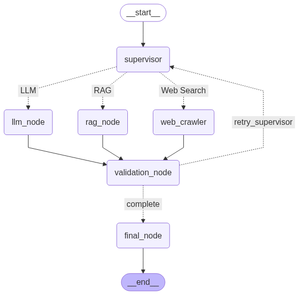
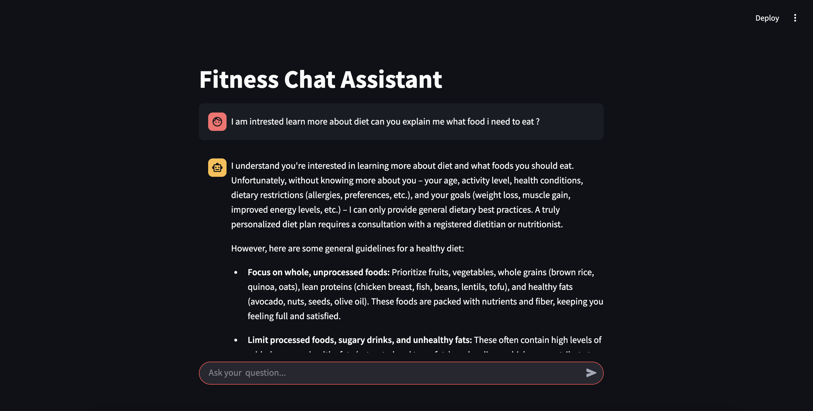
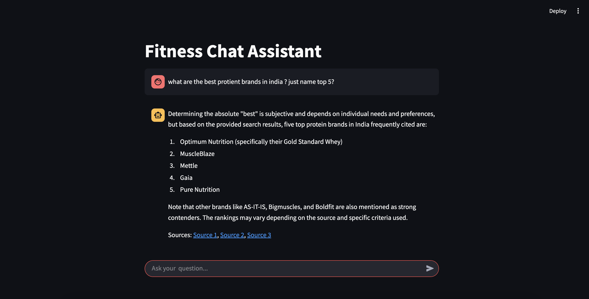

# Streamlit Chat-Based System

This project, located under the `08-01-2025` directory, is a Streamlit-based chat application that leverages an agent-based architecture for intelligent interactions. The system is designed to handle complex workflows using a language graph and integrates various utilities for seamless functionality.

## Project Structure

- **`main.py`**: The entry point of the application. This file runs the Streamlit-based chat interface and connects all components.
- **`utils/`**: Contains utility modules and classes:
  - **`agent.py`**: Implements the `Agent` class for building and managing agents.
  - **`pydantic_classes.py`**: Defines Pydantic models for data validation and serialization.
  - **`constants.py`**: Stores constants used across the project.
  - **`final_agent.py`**: Implements the final agent logic, including the language graph for advanced workflows.

## Features

1. **Agent-Based Architecture**: The system uses agents to handle tasks and workflows dynamically.
2. **Language Graph**: A graph-based approach to manage and execute complex language-based workflows.
3. **Streamlit Integration**: Provides an interactive chat interface for users.
4. **Modular Design**: Utilities and components are modularized for better maintainability and scalability.

## Getting Started

### Prerequisites

- Python 3.9 or higher
- Streamlit
- Pydantic
- Langchain
- Langgraph

### Installation

1. Clone the repository.
2. Navigate to the `08-01-2025` directory.
3. Install dependencies:
4. Run the project

## Images

The following images are included in the `iamges/` folder:

- **Langraph Diagram**:   
  A diagram illustrating the architecture of the system.

- **Chat Interface Screenshot**:   

- **Chat Interface Screenshot**:   
